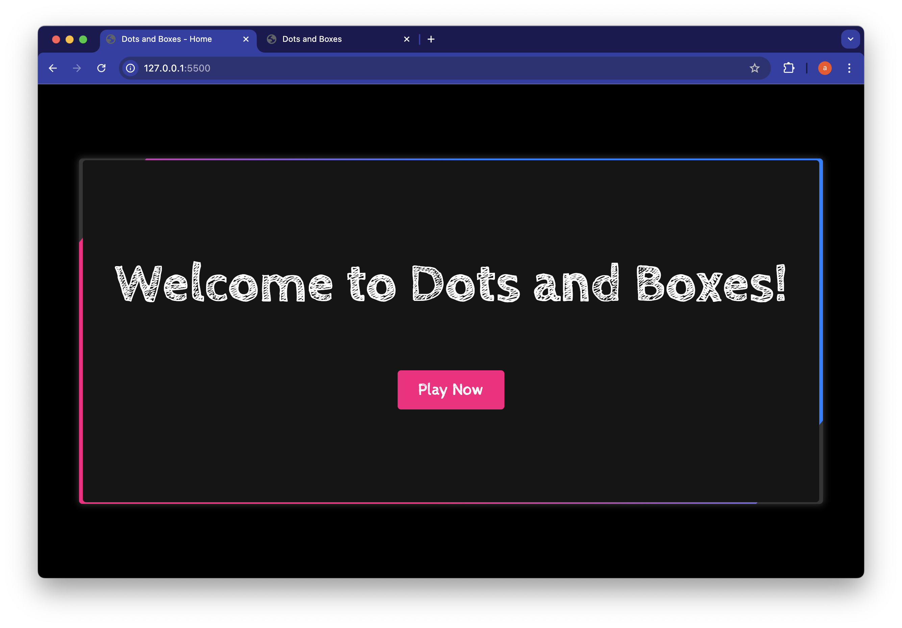
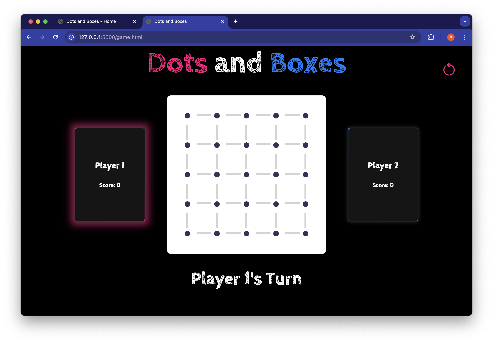

# Dots and Boxes
 ## Date: 4/9/2024
 ### By: Ayah Ahmed
 [Website](https://dotsandboxes-ayah.surge.sh) |
 [GitHub](https://github.com/ayahae79) |
 [Linkedin](www.linkedin.com/in/ayah-jawad-78a6071b0) 
 ***
 ### ***Description***
 A simple web-based implementation of the classic Dots and Boxes game. Players take turns drawing lines to complete boxes and compete for the highest score. Built with HTML, CSS, and JavaScript.
 ***
 ### ***Technologies Used***
 * HTML
 * CSS
 * JavaScript
 * Surge
 ***
 ### ***Getting Started***
  * Clone the repository to your local machine using the command:
   git clone https://github.com/ayahae79/dots-and-boxes.git
  * Open the index.html file in your preferred web browser to start playing.
 The project itself was deployed and can be viewed [here](https://dotsandboxes-ayah.surge.sh).
 ***
 ### ***Screenshots***
 #### Home Scren
 
 #### Game Scren
 

 ***
 ### ***Future Updates***
 - [ ] Add multiplayer support
 - [ ] Add basic AI for computer opponent
 - [ ] Add multiple stages of the game 
 - [ ] Add difficulty preference

 ***
 ### ***Credits***
 #### cards css [uiverse](https://uiverse.io/cards)
 #### Markdown Guid [ia.net](http://www.ia.net)
 #### Markdown Cheatsheet [GitHub](http://www.GitHub.com)
 #### Element relationships  [MDN](https://developer.mozilla.org/en-US/docs/Web/API/Element)
 #### Cabin Sketch Font [Google Fonts](https://fonts.google.com/specimen/Cabin+Sketch?icon.size=24&icon.color=%235f6368&preview.layout=grid)

